

  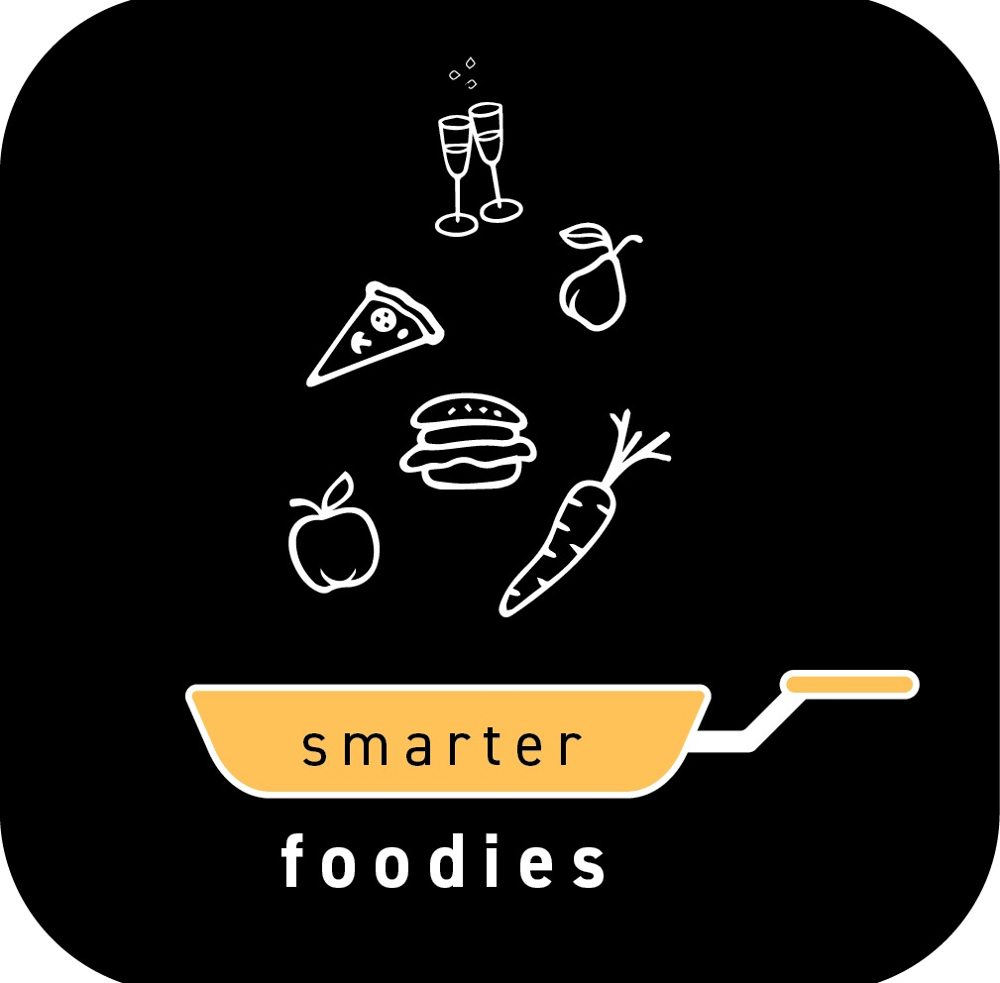
  <h1>SmarterFoodies Recipe App 👨‍🍳</h1>
  
Welcome to SmarterFoodies🔪🍰, the ultimate platform for culinary enthusiasts to showcase their talents and discover delightful recipes from around the world.
Whether you're a seasoned chef or simply passionate about cooking, SmarterFoodies is the perfect place to express and share your culinary creations.

 

## Features 🌟

### User Authentication 📲

- **Login with Google**: Easily sign in with your Google account for a seamless experience.

### User Types 🧑‍🍳

- **Regular Users**: Browse, explore, and enjoy a wide range of recipes created by our talented chefs.

- **Chefs**: Aspiring or experienced chefs can create, edit, and share their own culinary masterpieces with the SmarterFoodies community.

### Becoming a Chef 👨‍🍳

- To become a Chef, simply send a request from the app to SmarterFoodies via email, introducing yourself and your passion for cooking.
We'll review your request and grant you the privileges once approved.

### Recipe Creation 🍳

- Chefs can easily add new recipes, complete with mouthwatering photos (at least one is required) and detailed instructions.

- Only the user who uploaded a recipe has the authority to edit or modify it.

### Profile Page 📷

- Personalize your profile by adding your picture and updating your details to showcase your culinary style.

### Main Feed 📰

- Explore a beautifully curated feed containing a diverse selection of recipes from our talented community.

- Search for specific recipes or use the filter to discover dishes tailored to your taste preferences.

### Liked Recipes ❤️

- Show appreciation for your favorite recipes by liking them. You can always revisit these recipes for quick access.

- Discover the **Mystery Box** in your liked recipes feed, which presents a random recipe from your liked list to keep your culinary adventures exciting.

### My Uploads 📤

- Check out your own culinary creations in the "My Uploads" section in your pfrofile. See the recipes you've shared with the community in one convenient place.

- Experience the thrill of the **Mystery Box** here as well, offering a surprise recipe from your uploads to inspire your cooking journey.

### Recipe Cart 🛒

- Create your own recipe cart by adding recipes that you want to try.

- Easily send your cart to yourself or friends via WhatsApp. The app intelligently combines ingredient quantities to produce a convenient shopping list.

### Search for Specific Recipe 🔍

- Easily find a particular recipe that piques your interest by using the built-in search functionality. 

- Simply enter the recipe name in the auto complete search bar to quickly locate specific recipes within the vast SmarterFoodies database.

- Whether you're craving a specific cuisine, a particular ingredient, or a favorite dish, our search feature helps you discover your desired recipes with ease.

### Filter by Taste Preferences 🍲

- Tailor your recipe browsing experience to match your taste preferences using the powerful filtering options.

- Refine your search results to discover recipes that perfectly align with your culinary preferences, ensuring that you find the ideal dishes to satisfy your cravings.

With the search and filter features, SmarterFoodies empowers you to explore, discover, and enjoy recipes that match your unique culinary interests and dietary needs. Happy cooking!

## How to Get Started 🚀

1. Sign in with your Google account to get access to SmarterFoodies.

2. Explore the main feed to discover mouthwatering recipes or use the search and filter options to find specific dishes.

3. Like your favorite recipes to keep them handy for future reference, and don't forget to explore the **Mystery Boxes** in your liked recipes and uploads.

4. Add your desired recipes to your cart to export a grocery cart of your liking to whatsapp.

### How To Get Started As A Chef 👨‍🍳

1. Become a Chef by sending a request to SmarterFoodies via email, telling us about your culinary passion.

2. Create your own culinary masterpieces by adding recipes and photos to share with the community.

3. Personalize your profile page to showcase your unique cooking style.

4. Check out your own uploads and the surprising **Mystery Box** in the "My Uploads" section.

## Human Interface Design

Our UI is a canvas of user-centric design, harmoniously merging aesthetics and functionality to craft an unparalleled experience.

Key screens include:

## Table of Contents

| Login | Apply As Chef | Main Feed |
| :---: | :---: | :---: |
| 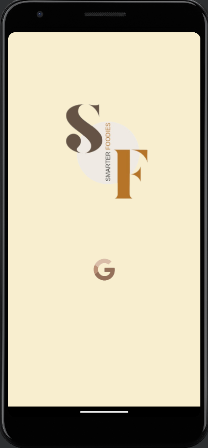 |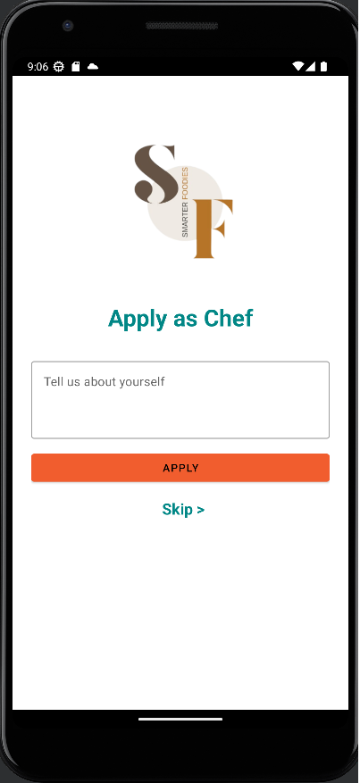  | 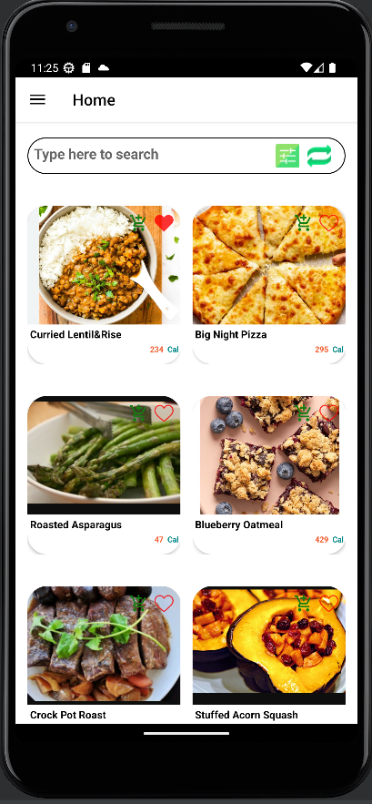 |

| Regular Menu | Chefs Menu | Upload New Recipe |
| :---: | :---: | :---: |
|  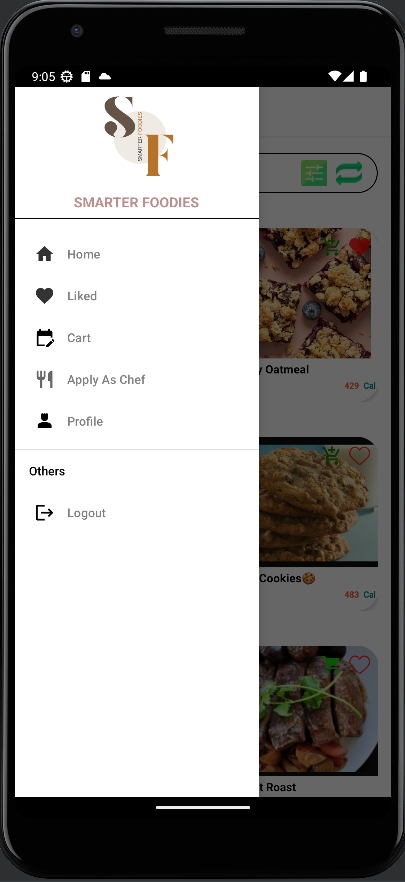  | 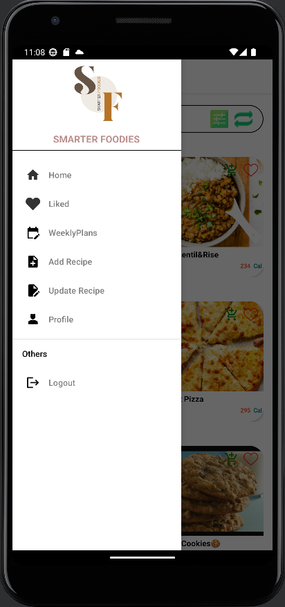 | 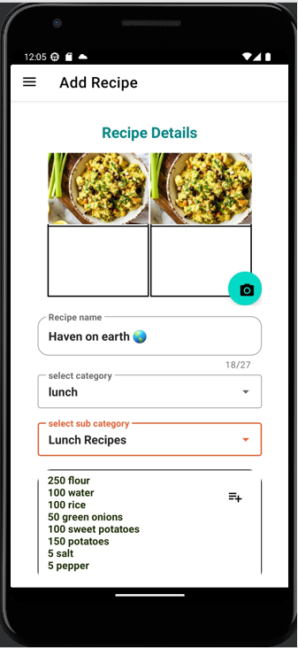 |

| Liked | Cart | Recipe Page |
| :---: | :---: | :---: |
|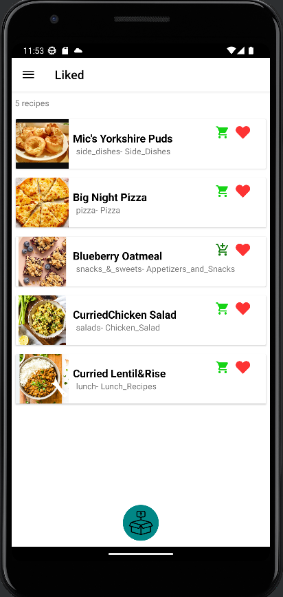| 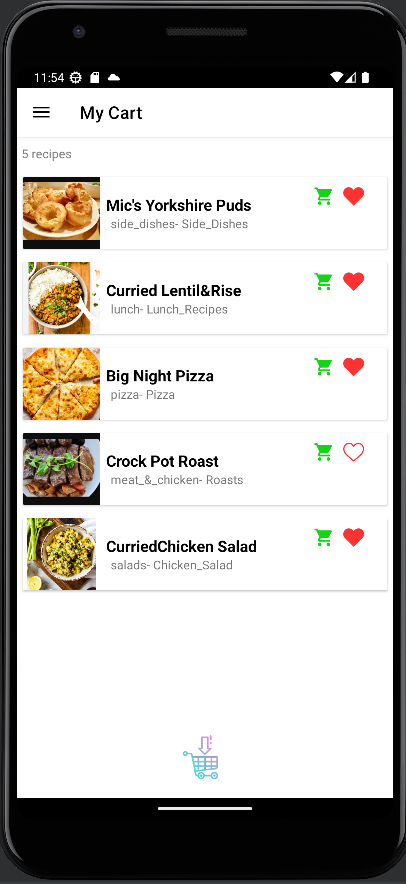 | 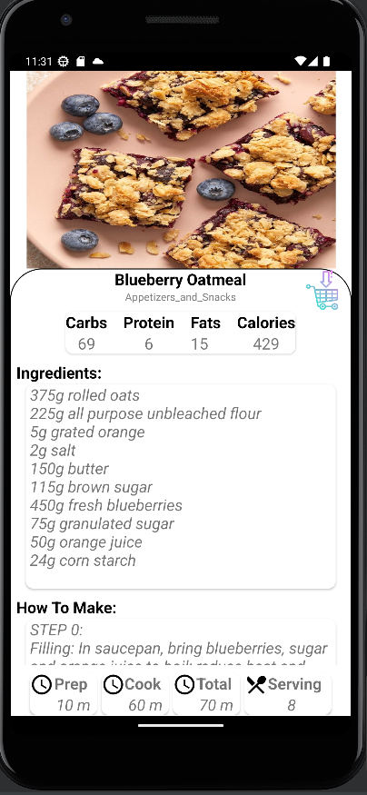 |

| Export Groceries List | Search | Filter |
| :---: | :---: | :---: |
| 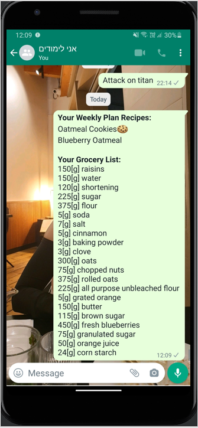 | 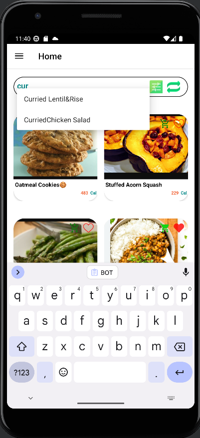 | 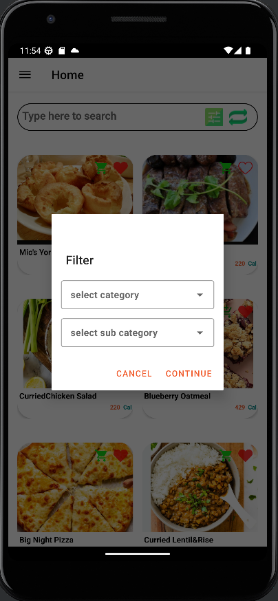 |

## Technologies Used 🧰

- **Development Environment**: Android Studio (Java)

- **Database**: Firebase Realtime Database

## Contributing 🤝

We welcome contributions from fellow foodies and developers to make SmarterFoodies even better. Feel free to submit bug reports, feature requests, or contribute directly to the codebase.

## 📜 License

This project is licensed under the [Creative Commons Attribution-NonCommercial 4.0 International License (CC BY-NC 4.0)](https://creativecommons.org/licenses/by-nc/4.0/). This means that you are free to share, adapt, and build upon the material, as long as you provide appropriate attribution, do not use the material for commercial purposes, and do not impose additional legal restrictions.

Please note that this license is designed to prevent commercial usage of the code. If you have any questions about how you can use or adapt this code within the terms of the license, feel free to [contact us](smartefoodies@gmail.com) 📮.

## Acknowledgments 👏

- Special thanks to the amazing SmarterFoodies community for making this platform a culinary paradise!

- Our dedicated team of chefs and developers who put their heart and soul into making SmarterFoodies a reality.

👩‍🍳👨‍🍳 Happy Cooking and Enjoy Exploring SmarterFoodies! 🍴🌍